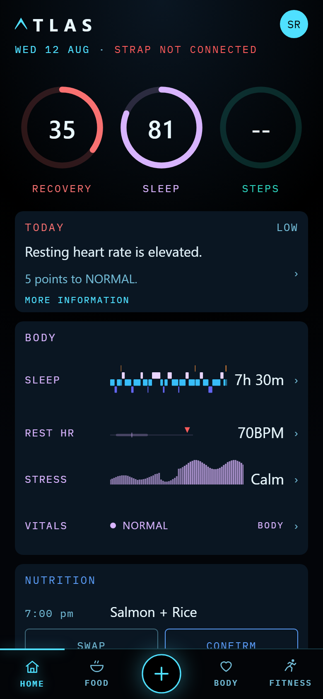
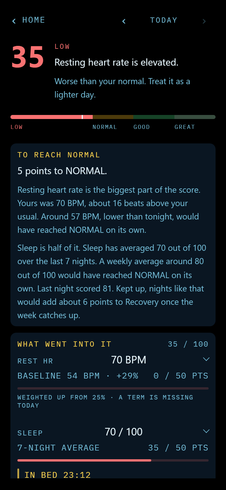
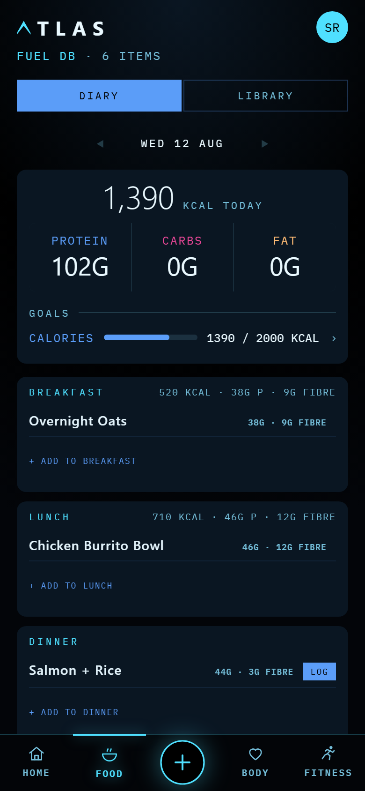
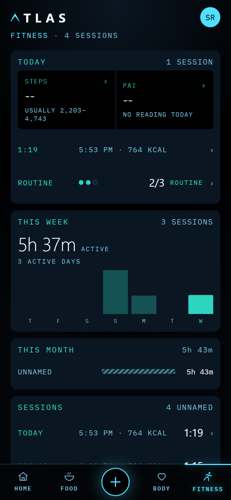

# Atlas

A daily check-in app for Android that reads an **Amazfit Helio Strap** directly
over Bluetooth and keeps its own archive on the phone.

No account, no server, no telemetry. Nothing leaves the phone except a barcode
lookup when you scan food.

**[⬇ Download Atlas](../../releases/latest/download/atlas.apk)** · Android 8.0 or
newer · [what you need first](#before-you-download-it)

<p align="center">
  
  
</p>

## What it does

- **A smart alarm that wakes you in light sleep.** Set a time; in the twenty
  minutes before it, Atlas checks what stage the strap has you in and buzzes
  early if you are already in light sleep. It writes the alarm to the strap
  itself, so the wake is a vibration on your wrist and it works with the phone
  face down in another room.
- **Recovery and sleep scores that show their working.** Both are judged against
  *your* baseline, not a population. Tap either and you get the arithmetic: each
  term's reading, the figure it was compared against, the points it gave up, and
  what would have to change to reach the next band.
- **A barcode scanner** into a food library, including scanning several things in
  a row and making one meal out of them.
- **A habit tracker built as a day**, not a checklist. Habits sit in morning, day,
  evening and night, so an empty evening bar at 4pm is the thing you see.
- **Session times you can correct.** The strap decides when a workout started and
  stopped, and it is often wrong: it splits one session into two, or stops counting
  during the standing around. You can drag either end against the heart-rate
  trace, merge what it split, split what it merged, and name any of it.
- **Nine metrics from the strap**, each with its own page: heart rate through the
  day, stress, HRV, resting heart rate, SpO2, breathing rate, skin temperature,
  steps and PAI.
- **Four themes**, two dark and two light.

<p align="center">
  
  
</p>

Food is a plan-and-confirm model rather than a diary: build a weekly template
once and confirm what you actually ate, so a normal day costs a couple of taps.
Composite recipes, per-day ingredient edits and a quick-add for holidays are all
there.

## Before you download it

Atlas was built for one person and is being opened up. Right now that means:

- **It needs an Amazfit Helio Strap specifically.** The Bluetooth layer looks for
  a bonded device with that exact name. Other Zepp OS bands speak a similar
  protocol and would probably work with a small change, but that is untested.
- **You have to supply a pairing key by hand, once.** No app can generate one.
  See [Pairing](#pairing).
- **The first two weeks are thin by design.** Recovery needs about a week of
  nights before it will show a score, and the baselines everything is judged
  against need a fortnight. Atlas shows the readings it has and how many nights
  are left rather than a placeholder, but it will not invent a score it cannot
  stand behind.

## Download

Every build is on the **[Releases](../../releases)** page. Download the newest
`.apk`, allow installs from your browser when Android asks, and open it. Android
will warn you about installing outside the Play Store, which is expected.

Or [build it yourself](#building-from-source).

## Pairing

The strap's auth key is issued by the vendor when the band is first bound to a
Zepp account. **No third-party app can generate one**, including this one.

Get yours by following the **"On a computer"** section of Gadgetbridge's guide:

<https://gadgetbridge.org/basics/pairing/huami-xiaomi-server/>

You sign in to Zepp yourself, in your own browser, and a snippet reads the token
out of your own cookie. Nothing acts on your behalf and no third party receives
your password. Paste the 32-character result into Atlas under
**Settings → Helio Strap**.

**Pair the strap in your phone's Bluetooth settings first.** Atlas looks it up
among your phone's bonded devices rather than scanning for it, so if it is not
paired there the connect fails with `device not found` before the key is ever
used. A strap can only be bonded to one phone at a time: to move it, forget it on
the old phone first.

You only need the key once. It survives app updates. It changes if you reset or
unbind the strap, so **do not factory reset a strap you have a working key for**
unless you are prepared to obtain a new one.

## Building from source

```sh
npm install
npm run build && npx cap sync android
cd android && ./gradlew assembleDebug
```

Open `android/` in Android Studio once first so it writes `local.properties` with
your SDK path. The `cap sync` step is not optional and fails silently if skipped:
the app will build, install and open to a blank white screen.

`npm test` runs the suite once and exits. Every test uses `fake-indexeddb`, so
nothing there exercises the real Android WebView.

## This is not a medical device

Atlas estimates things. It is not a medical device, it does not diagnose, treat
or monitor any condition, and nothing it shows you is medical advice. The sleep
and recovery scores are its own arithmetic over a consumer wearable's readings,
described openly in the app under HOW IT IS BUILT so you can judge them for
yourself. Talk to a healthcare professional about anything that matters.

## Licence

[GNU Affero General Public License v3.0 or later](LICENSE).

Third-party components and where the protocol knowledge came from are in
[NOTICE.md](NOTICE.md).
